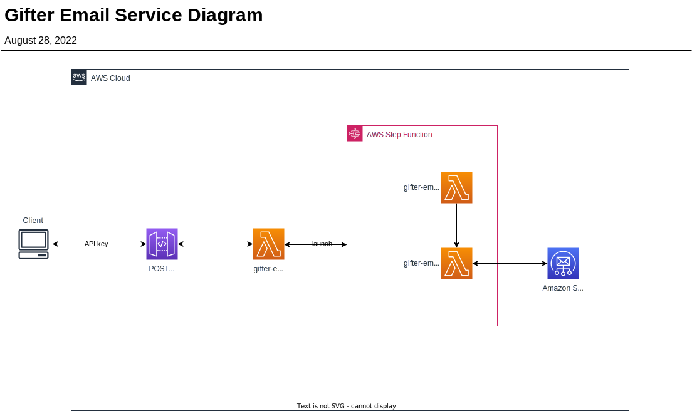

# gifter-email-service

An emailing service that supports the [Gifter](https://github.com/trpubins/Gifter) client application using Amazon SES over SMTP.

## Architecture

The client launches this service to send emails using Amazon SES. Leverages AWS Free Tier resources by using API Gateway, Lambda, and Step Functions.

